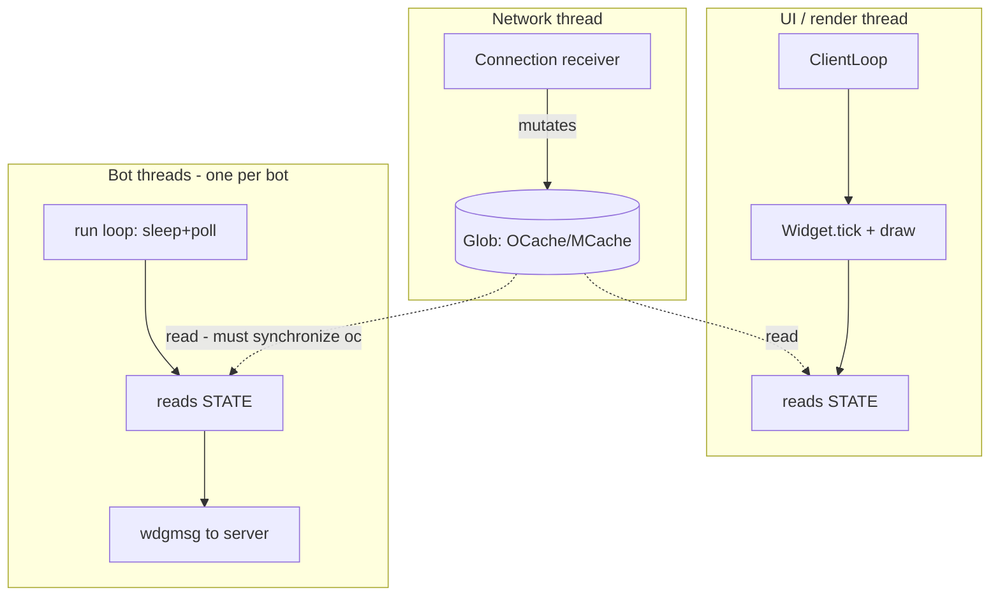
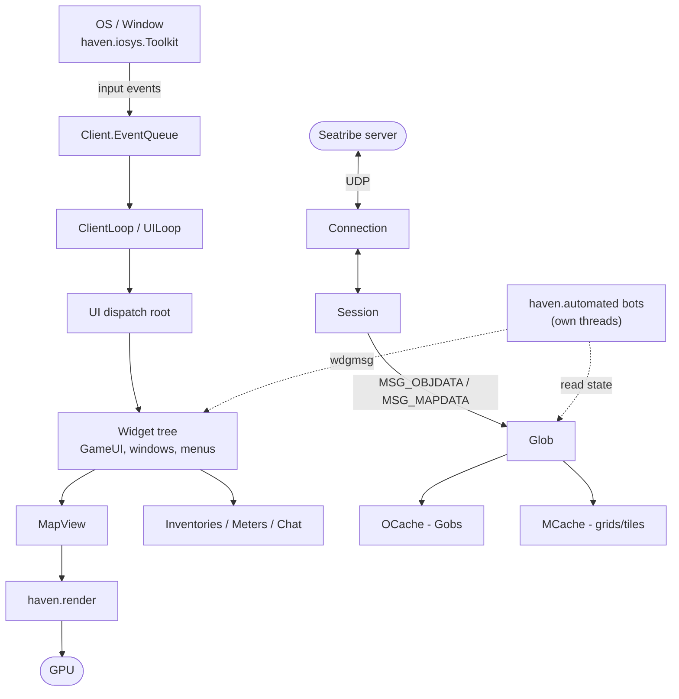

# Architecture Overview

Hurricane inherits the well-established **hafen-client** architecture. This note is the hub; each
layer has its own detailed note.

## Layered view

| Layer | Key types | Note |
|---|---|---|
| **Window / OS / input** | `haven.iosys.Toolkit`, `Windeye`, `Client` | [[Startup-and-Lifecycle]] |
| **UI loop & widgets** | `UILoop`, `UI`, `Widget`, `RootWidget`, `GameUI` | [[UI-and-Widget-System]] |
| **Networking** | `Session`, `Connection`, `Message`/`PMessage`/`RMessage` | [[Networking-and-Protocol]] |
| **World/game state** | `Glob`, `OCache`, `Gob`, `GAttrib`, `MCache` | [[Game-State-Model]] |
| **Rendering** | `haven.render.*`, `PView`, `MapView`, GL/JOGL/LWJGL | [[Rendering-Pipeline]] |
| **Resources** | `Resource`, `haven.res.*`, `FromResource`, `Sprite` | [[Resource-System]] |
| **Automation (Hurricane)** | `haven.automated.*` | [[Automation-Bots]] |

## How a frame happens (very high level)

1. The **window** (`haven.iosys` `Toolkit`/`Windeye`) feeds OS events into `Client.EventQueue`.
2. `ClientLoop` (a `UILoop`) ticks: it `dispatch()`es queued input into the current [[UI-and-Widget-System|`UI`]],
   runs widget logic (`tick`), then renders the widget tree.
3. The in-game root widget is [[UI-and-Widget-System|`GameUI`]]; it contains the 3D
   [[Rendering-Pipeline|`MapView`]], inventories, chat, menus, meters, etc.
4. `MapView` draws the world from [[Game-State-Model|`Glob`/`OCache`/`MCache`]] using the
   [[Rendering-Pipeline|`haven.render`]] pipeline.
5. Meanwhile the [[Networking-and-Protocol|`Session`]] thread receives server messages and mutates
   game state (adds/updates `Gob`s, map grids, widgets) asynchronously.

## Threads (mental model)

This is a **multi-threaded** client. The big ones:

- **Haven main thread** (`HackThread`, created in `Client.main`) → runs `main2()` → the UI loop.
- **`UILoop`/`ClientLoop`** rendering+logic loop.
- **`Session`/`Connection`** receiver & worker threads (network I/O, message dispatch).
- **`Loader`** / `Defer` worker threads for lazy resource loading.
- **Automation threads** — each Hurricane [[Automation-Bots|bot]] runs on its **own `Thread`**
  (often the bot is *both* a `Window` and a `Runnable`). See [[Automation-Bots#Lifecycle]].



> [!warning] Concurrency rule
> Game-state containers like `OCache` are touched from multiple threads. Code that iterates them
> (especially bots) must `synchronized(gui.map.glob.oc) { ... }`. See [[Coding-Conventions#Threading]].

## Data/control flow diagram



Text version (same thing, for plain-text/RAG consumers):

```
        ┌────────────── OS / Window (haven.iosys.Toolkit) ──────────────┐
        │ input events                                   present frame  │
        ▼                                                               ▲
  Client.EventQueue ──► ClientLoop(UILoop) ──► UI ──► Widget tree (GameUI…)
                                                  │            │
                                                  │            ├─► MapView ──► haven.render ──► GPU
                                                  │            └─► Inventories / Windows / Menus
                                                  │
   server ⇄ Connection ⇄ Session ──(widget msgs / object updates / map data)──► Glob
                                                  │                               ├─ OCache (Gob*)
                                                  │                               └─ MCache (grids)
                                                  ▼
                              haven.automated.* bots (own threads) read state & send wdgmsgs
```

## Where to look for X

- "How does login work?" → [[Startup-and-Lifecycle]] (`Bootstrap`, `LoginScreen`, `AuthClient`).
- "How does the client know about a tree/animal/player on screen?" → [[Game-State-Model]] (`Gob`).
- "How do I draw something / why is rendering abstracted?" → [[Rendering-Pipeline]].
- "How do clicks/menus reach the server?" → [[UI-and-Widget-System#wdgmsg]].
- "Where is feature/bot X?" → [[Automation-Bots]] and [[Package-Map]].

## Related
- [[Project-Overview]] · [[Package-Map]] · [[Key-Classes]]

#architecture
