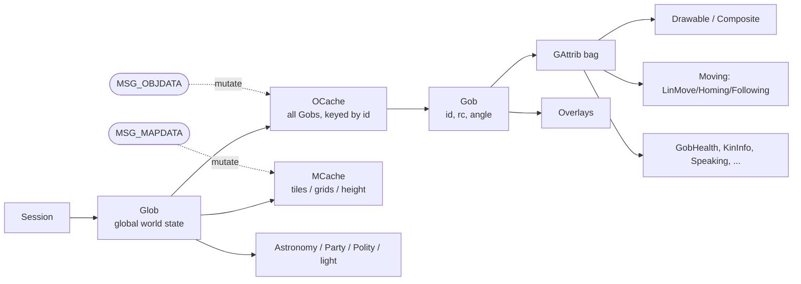

# Game State Model

How the client represents "the world." Source: `src/haven/Glob.java`, `src/haven/OCache.java`,
`src/haven/Gob.java`, `src/haven/GAttrib.java`, `src/haven/MCache.java`, `src/haven/MapFile.java`,
`src/haven/Party.java`.

## `Glob` — the global session state

`Glob` (one per [[Networking-and-Protocol|`Session`]]) is the root of mutable world state. It holds:
- `oc` → the [[#OCache|object cache]] (all `Gob`s).
- `map` → the [[#MCache|map cache]] (tiles/grids).
- World-wide info: `Astronomy` (in-game time/season/moon), `Party`, `Polity` (villages/realms),
  light/weather, server time, etc.

Access pattern in code: `gui.ui.sess.glob`, or via a `MapView`: `gui.map.glob`.

## `OCache` — the object cache (Gobs)

`OCache` is the registry of every **game object** (`Gob`) the client currently knows about, keyed
by a server-assigned `long id`. The [[Networking-and-Protocol|`MSG_OBJDATA`]] stream drives it:
objects are created, moved, mutated, and removed as deltas arrive.

- Lookup: `oc.getgob(id)`.
- Iteration: `OCache` is `Iterable<Gob>` — but **must be synchronized** (it changes on the network
  thread): `synchronized(oc) { for (Gob g : oc) { … } }`. This is the single most common pattern in
  [[Automation-Bots|bots]].
- `posres` (`OCache.posres`) is the fixed-point resolution used for object positions.

## `Gob` — a game object

A `Gob` (`src/haven/Gob.java`, ~2500 lines) is anything in the world: your character, other
players, animals, trees, items on the ground, buildings, vehicles, effects, etc.

Key fields/concepts:
- `id` (long), `rc` (`Coord2d` real-world position), `a` (angle/orientation).
- **`GAttrib`s** — a `Gob` is a bag of typed attributes (a tiny ECS). Examples:
  - `Drawable`/`ResDrawable`/`Composite` — how it's drawn (which [[Resource-System|resource]]).
  - `Moving` (`LinMove`, `Homing`, `Following`) — movement interpolation.
  - `KinInfo`, `Speaking`, `GobHealth`, overlays, etc.
  - Get one with `gob.getattr(SomeAttrib.class)`.
- **`Overlay`s** — transient visual/logical layers attached to a Gob (e.g. progress effects,
  highlights). Hurricane checks these heavily (`AUtils.gobHasOverlay(...)`).
- **Resource name** — `gob.getres().name` (e.g. `gfx/kritter/bear/bear`). Bots identify object
  types by this string. See `AUtils.potentialAggroTargets` in [[Automation-Bots]].

> [!note] Hurricane additions
> Many `Gob*Info.java` / `Gob*Highlight.java` classes in `haven.*` are Hurricane QoL features that
> render quality, growth %, food/water, combat data, etc. on top of base Gobs.

## `MCache` — the map cache

`MCache` stores the **tiled map**: the world is divided into **grids** (`MCache.cmaps` tiles per
grid) of **tiles** (`MCache.tilesz` units per tile). Driven by
[[Networking-and-Protocol|`MSG_MAPDATA`]].

- Tile types resolve to `Tiler`/`Tileset` resources for rendering (see [[Rendering-Pipeline]] and
  `MapMesh`).
- `Grid`s carry tile ids, height (`z`), overlays, and flavor objects.
- `MapFile` persists explored map data to disk (the client's saved minimap/map).
- Common constants imported by bots: `import static haven.MCache.cmaps;` and `… tilesz;`.

## Coordinates (read [[Glossary]] too)

Multiple coordinate spaces coexist — a frequent source of bugs:
- `Coord` — integer 2D (pixels, tiles, grid indices depending on context).
- `Coord2d` — double-precision world coordinates (object positions, `gob.rc`).
- `Coord3f` / `Coord3d` / `Coordf` — float/3D for rendering.
- Conversions go through `tilesz`, `posres`, and helpers in `Coord*`/`MCache`.

## Related
- [[Networking-and-Protocol]] · [[Rendering-Pipeline]] · [[Automation-Bots]] · [[Glossary]]

#architecture #game-state
