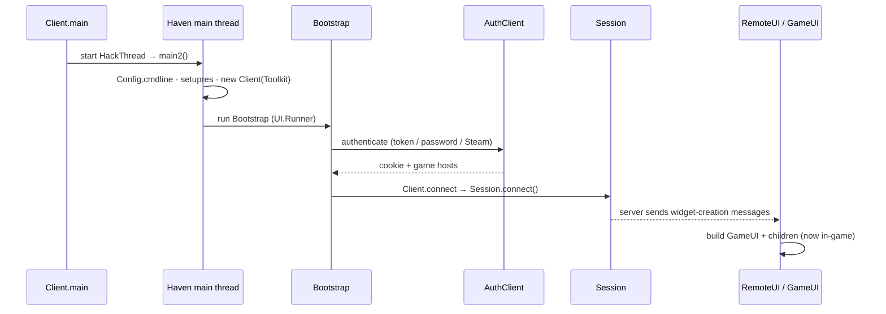

# Startup and Lifecycle

Source of truth: `src/haven/Client.java`, `src/haven/Bootstrap.java`, `src/haven/LoginScreen.java`,
`src/haven/RemoteUI.java`.

## Entry point: `haven.Client.main(String[])`

The JAR manifest's `Main-Class` is `haven.Client` (see `build.xml` → `jar` target).

`Client.main()` does the minimal bootstrapping then hands off to a dedicated thread:

1. Installs an **error handler thread group** (`haven.error.ErrorHandler` /
   `SimpleHandler`) as early as possible, based on the `haven.errorurl` property.
2. Starts the **"Haven main thread"** (`HackThread`) which runs `main2(args)`.
3. After spawning, on the calling thread it also calls:
   - `GobIcon.initPresets()` — load map-icon presets
   - `AlarmManager.init()` — Hurricane alarm system
   - reads the `runningThroughSteam` system property into `Client.runningThroughSteam`.

### Static initializer (runs on class load)

`Client`'s `static { ... }` block sets up game directory + SQLite-backed data **before** anything
else (note: throws `RuntimeException` on `SQLException`):
- Resolves `gameDir` (Steam workshop path vs empty for standalone).
- `FlowerMenu.createDatabaseIfNotExist()` + `FlowerMenu.fillAutoChooseMap()` — flower-menu
  auto-select data (SQLite `static_data.db`).
- `HitBoxes.createDatabaseIfNotExist()` + `HitBoxes.loadCollisionBoxMap()` — collision boxes
  (SQLite `hitboxes.db`). See [[Automation-Bots#helpers]].

## `main2(String[])`

```
Utils.initlocale();
Config.cmdline(args);                       // parse CLI + load config (see haven.Config)
haven.error.ErrorHandler.setprop("jar.config", Config.confid);
setupres();                                 // resource caches, resource URL, preload lists
Client cl = new Client(Toolkit.instance()); // creates the OS window (Windeye), icon, sizing
… choose a UI.Runner …
cl.run(main);                               // runs the UI loop until exit, then System.exit(0)
```

### Choosing the initial `UI.Runner`

`main2` picks what to run first:
- `Bootstrap.replay` set → **playback** mode: `Transport.Playback` + `RemoteUI` (replays a session
  log instead of connecting).
- `Bootstrap.servargs` set → connect directly via `connect(args)` → `RemoteUI`.
- otherwise → `cl.new Main()` (the normal interactive path).

## The window & UI loop

- `new Client(Toolkit)` creates the OS window via `haven.iosys` `Windeye`, sets size/fullscreen
  from prefs (`mainwnd/size`, `mainwnd/max`, `mainwnd/locksize`), the icon, and registers the
  `EventQueue` listener.
- `Client.run(task)` creates a **`ClientLoop`** (subclass of `UILoop`), `start()`s it, then loops:
  `task = task.run(newui(task))` until `task == null` or interrupted. Each `UI.Runner` returns the
  next runner to execute (a simple state machine).
- `Client.Main` (a `UI.Runner`) sets the window title to `Hurricane (<version>)` (optionally
  `… – <subtitle>`) and starts with a `Bootstrap` runner.

## Login & connection flow



```
Bootstrap (UI.Runner)
   ├─ shows LoginScreen  (username/password or saved token)
   ├─ AuthClient → auth server (Bootstrap.authserv)  → credentials + cookie
   └─ Client.connect(args)
          └─ Session.connect(addr, acct, encrypt, cookie, args)   // see Networking
                 └─ returns Session → new RemoteUI(session) becomes the next UI.Runner
RemoteUI
   └─ drives the in-game UI; server sends widget-creation messages that build GameUI & children
```

Key classes: `Bootstrap` (server/auth properties + flow), `LoginScreen`/`Charlist`/`AccountList`
(UI), `AuthClient` (auth protocol, token/password creds), `Steam*` (Steam auth path),
`RemoteUI` (binds a `Session` to a `UI`).

## Shutdown

- Closing the window posts a `Toolkit.CloseRequest` → `EventQueue` interrupts the main thread.
- `Client.run` saves window state (`savewndstate()`), disposes the loop, and `main2` ends with
  `System.exit(0)`.
- The `q` console command (`Client.findcmds`) also interrupts the main thread to quit.

## Related
- [[Networking-and-Protocol]] · [[UI-and-Widget-System]] · [[Architecture-Overview]]

#architecture #startup
