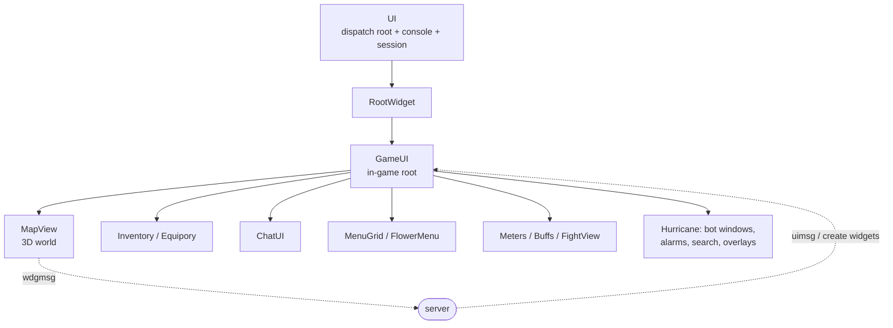

# UI and Widget System

Source: `src/haven/Widget.java` (~1800 lines), `src/haven/UI.java`, `src/haven/RootWidget.java`,
`src/haven/GameUI.java` (~2900 lines), `src/haven/Window.java`, `src/haven/MenuGrid.java`,
`src/haven/FlowerMenu.java`, plus dozens of widget subclasses.

## The widget tree

Everything on screen is a **`Widget`**. Widgets form a tree:



```
UI (input/dispatch root, owns the console + session)
└─ RootWidget
   └─ GameUI            (in-game root: created by the server after login)
      ├─ MapView        (the 3D world — see Rendering-Pipeline)
      ├─ Inventory(s), Equipory, CharWnd, MapWnd, ChatUI, MenuGrid, FlowerMenu,
      │  meters (IMeter/VMeter), Buff list, FightView, … many more
      └─ Hurricane additions: alarm windows, bot windows, search windows, overlays
```

- `UI` (`src/haven/UI.java`) is the dispatch root: it routes input events, holds the `Console`,
  the [[Networking-and-Protocol|`Session`]] (`ui.sess`), key bindings, and the widget registry.
- `Widget.addchild(Widget child, Object... args)` builds the tree.

## Two message directions (CRITICAL concept)

The server and client widgets communicate through **string-named messages with varargs**:

| Method | Direction | Meaning |
|---|---|---|
| `widget.uimsg(String msg, Object... args)` | **server → client widget** | "update yourself" (the server drives UI state). |
| `widget.wdgmsg(String msg, Object... args)` | **client widget → server** | user did something (click, select, etc.). Bubbles up the parent chain via `wdgmsg(sender, msg, args)` until it reaches `UI`, which sends it over the wire. |

> [!important] This is how almost everything reaches the server.
> When a [[Automation-Bots|bot]] "clicks" a menu, equips an item, or moves the character, it is
> ultimately calling some widget's `wdgmsg(...)` (e.g. `gui.map.wdgmsg("click", …)`,
> `inv.wdgmsg("drop", …)`, `flowermenu petal select`). The server replies with `uimsg`/object
> updates that mutate state.

The server also **creates and destroys widgets** by id via reliable messages; `Widget.Factory`
(`Widget.java:142`) maps a server widget-type name to a constructor. This is why the UI is largely
"server-authoritative."

## Per-frame lifecycle

- `tick(double dt)` / `tick(TickEvent ev)` — update logic each frame (animations, timers).
- `draw(GOut g)` — paint. **`GOut`** is the 2D drawing context (text, images, rects, clipping);
  it wraps the [[Rendering-Pipeline|render]] backend for 2D HUD drawing.
- Input handlers return `boolean` (consumed?): `mousedown/mouseup/mousemove/mousewheel`,
  `keydown/keyup`. Events are AWT-flavored via `AWTCompat` even though the window isn't real AWT.

## `GameUI` — the in-game hub

`GameUI` is the most-edited core class in Hurricane. It aggregates: the `MapView` (`gui.map`),
inventories (`gui.maininv`), equipory (`gui.getequipory()`), chat (`gui.chat`), the fight view
(`gui.fv`), progress bar (`gui.prog`), meters (`gui.getmeter("stam"/"hp"/"nrj", …)`), the flower
menu (`gui.menu`), crafting (`gui.makewnd`), and the cursor-held item (`gui.vhand`).

Hurricane wires its features into `GameUI`:
- **Keybindings** (`KeyBinding kb_*` fields, e.g. `kb_aggroNearestTargetButton`) → in `keydown`
  they launch [[Automation-Bots|bots]] via `runActionThread(new Thread(new SomeBot(this), "…"))`.
- `runActionThread(Thread)` runs exactly **one** keybound action thread at a time (it interrupts
  the previous one). Some bots instead keep their own dedicated thread field
  (e.g. `lootNearestKnockedPlayerThread`).

See [[Automation-Bots#How bots are triggered]].

## Menus

- `MenuGrid` — the action/paginae grid (bottom-right). Server-defined actions ("paginae").
- `FlowerMenu` — the radial right-click context menu. Hurricane adds **auto-select** of petals
  (SQLite `static_data.db`, `FlowerMenu.fillAutoChooseMap`) so chosen actions can be automated.

## Config / options UI

- `OptWnd` — the settings window (many Hurricane toggles live here).
- `KeyBinding` / `KeyMatch` — the keybinding system used for all hotkeys (vanilla + Hurricane).

## Related
- [[Rendering-Pipeline]] · [[Automation-Bots]] · [[Combat-System]] · [[Game-State-Model]]

#architecture #ui
