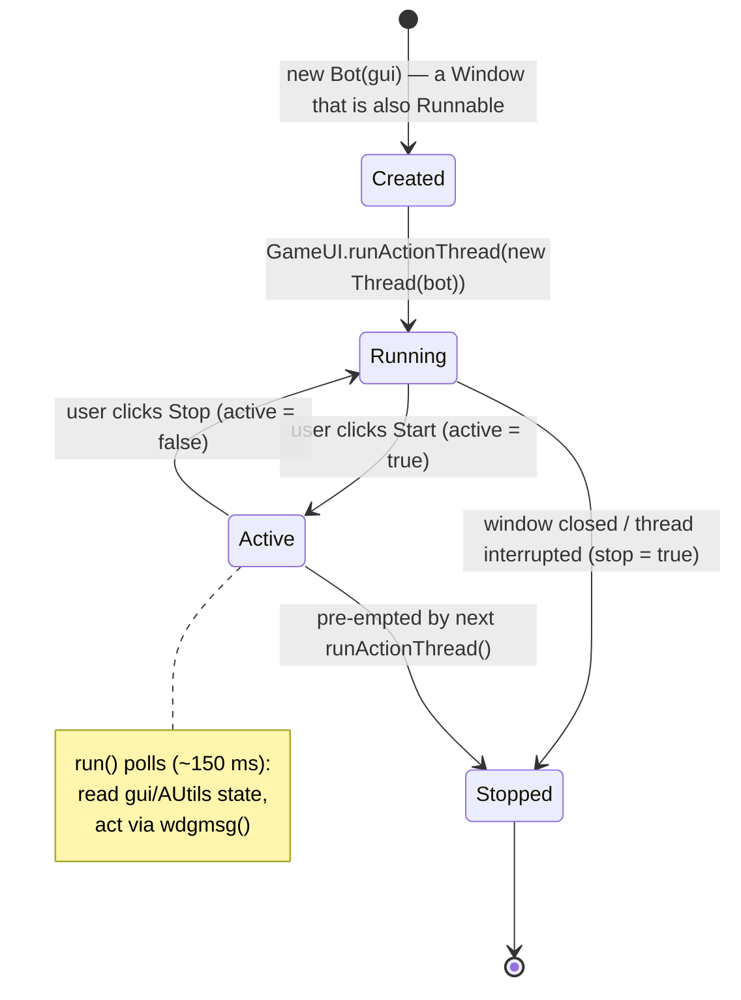

# Automation Bots — `haven.automated` ⭐

This is **Hurricane's flagship custom subsystem** and the part most likely to be edited. It is a
**complete custom addition** not present in vanilla `hafen-client`. Source: `src/haven/automated/**`.

Related: [[Pathfinding]] · [[Combat-System]] · [[UI-and-Widget-System]] · [[Game-State-Model]] ·
[[Adding-a-New-Bot]]

## The bot pattern (read this first)

Most bots follow one consistent shape — **a `Window` that is also a `Runnable`**, run on its own
`Thread`:

```java
public class CellarDiggingBot extends Window implements Runnable {
    private final GameUI gui;
    private boolean stop;       // hard stop (kills the thread loop)
    private boolean active;     // soft start/stop toggle from the button
    private final Button activeButton;

    public CellarDiggingBot(GameUI gui) {
        super(UI.scale(150, 70), "Cellar Digging Bot"); // it's a draggable window
        this.gui = gui;
        activeButton = new Button(UI.scale(150), "Start") {
            public void click() {
                active = !active;
                this.change(active ? "Stop" : "Start");
                if (!active) haltActions();
            }
        };
        add(activeButton, UI.scale(0, 10));
        pack();
    }

    public void run() {                 // the bot's brain, on its own thread
        try {
            while (!stop) {
                if (!checkVitals()) { sleep(200); continue; }
                if (active) { /* do one step of work using AUtils + gui */ }
                sleep(200);             // POLLING loop (no event hooks)
            }
        } catch (InterruptedException e) { /* thread stopped */ }
    }
}
```

Key properties (verified across `CellarDiggingBot`, `FishingBot`, `MiningSafetyAssistant`, …):
- **Polling, not event-driven.** Bots `Thread.sleep(...)` and re-check game state each loop.
- **Two flags:** `stop` (terminate thread) and `active` (Start/Stop button toggle). Closing the
  window or interrupting the thread ends it.
- **All actions go through the normal client paths** — they call helpers in `AUtils` and send
  `wdgmsg`s exactly like a human clicking. See [[UI-and-Widget-System#wdgmsg]].
- Simpler "one-shot" scripts (e.g. `StackAllItems`, the `Aggro*` actions) are plain `Runnable`s
  with no window — they do one job and exit.

## How bots are triggered



Bots are launched from **four** places (all converge on "make a `new Bot(gui)`, run it on a
`Thread`"):

**1. The custom action menu — `MenuGrid` (primary launcher for windowed bots).**
Hurricane adds custom paginae (see `res/customclient/menugrid/`) under categories like `Bots` and
`Toggles`. Selecting one **toggles** the bot: create + `gui.add(bot)` + start its thread, or stop +
`reqdestroy()`. The bot instance and its thread are stored as fields on `GameUI`
(e.g. `gui.fishingBot` + `gui.fishingThread`), and the window position is remembered
(`wndc-<bot>Window` pref). Code: `src/haven/MenuGrid.java` (the big `if (ad[1].equals("Bots"))` block).

```java
// MenuGrid.java — toggle the FishingBot window+thread on/off
if (gui.fishingBot == null && gui.fishingThread == null) {
    gui.fishingBot = new FishingBot(gui);
    gui.add(gui.fishingBot, Utils.getprefc("wndc-fishingBotWindow", ...));
    gui.fishingThread = new Thread(gui.fishingBot, "FishingBot");
    gui.fishingThread.start();
} else { gui.fishingBot.stop(); gui.fishingBot.reqdestroy(); gui.fishingBot = null; gui.fishingThread = null; }
```

**2. Keybindings — `GameUI` (quick combat/interaction actions).**

```java
// in GameUI.keydown(...):
} else if (kb_aggroNearestTargetButton.key().match(ev)) {
    this.runActionThread(new Thread(new AggroNearestTarget(this), "AggroNearestTarget"));
    return true;
}
```

- `GameUI.runActionThread(Thread t)` runs **one** keybound action thread at a time: it interrupts
  the previously running one, stores `keyboundActionThread = t`, and `t.start()`s it.
- `GameUI.stopActionThread()` interrupts the current action thread (comment notes the "Havoc"
  lineage — see [[Project-Overview#Fork lineage]]).
- Some long-lived ones keep their **own** thread field (e.g. `lootNearestKnockedPlayerThread`,
  `interactWithNearestObjectThread`), toggled per keypress.
- Keybindings are `public static KeyBinding kb_*` fields (`KeyBinding.get(id, KeyMatch...)`),
  rebindable via `OptWnd`. See [[Bot-Index]] for the full verified key map.

**3. Inventory / window context menus — `Window.java`.** Right-click actions on inventory windows
start `StackAllItems` / `UnstackAllItems` (`new Thread(new StackAllItems(gui, inv)).start()`), and
`InventorySorter.start(...)` sorts an inventory.

**4. Item interactions — `WItem.java`.** `AutoRepeatFlowerMenuScript` is started from an item's
interaction (repeats an action that opens a flower menu, auto-selecting petals).

A few helpers are created directly and persist (e.g. `questhelper = new QuestHelper()` in `GameUI`).

> [!tip] Verified trigger map
> See **[[Bot-Index]]** for the exact launcher, default key, pref id, and thread field of every bot.

## `AUtils` — the shared toolkit

`src/haven/automated/AUtils.java` (~450 lines) is the **standard library** every bot uses. Always
prefer these over re-implementing. Notable members (names are stable references):

**Targeting / combat**
- `potentialAggroTargets` — a big `HashSet<String>` of creature resource names
  (e.g. `gfx/kritter/bear/bear`) used to decide what's attackable.
- `getAllAttackableMap(gui)`, `getAllAttackablePlayersMap(gui)`, `attackGob(gui, gob)`.

**Items / inventory**
- `findItemByPrefixInAllInventories(gui, prefix)`, `findItemInInv(inv, resName)`.
- helpers to gather all items across inventories/stacks (excluding belt/keyring).
- `clickWItemAndSelectOption(gui, witem, idx)`.

**Gobs / world**
- `getGobs(name, gui)`, `getAllSupports(gui)` (mine supports),
- `gobHasOverlay(gob, overlayResName)`,
- `rightClickGobAndSelectOption(...)`, `rightClickGobOverlayAndSelectOption(...)`.

**Synchronization / waiting** (the polling primitives)
- `waitForEmptyHand(gui, timeout, err)`, `waitForOccupiedHand(gui, …)` — cursor item state.
- `waitProgBar(gui)` — wait for the progress bar to finish (`gui.prog`).
- `waitPf(gui)` — wait for pathfinding to finish (`gui.map.pfthread`).

**Misc**
- `drinkTillFull(gui, threshold, stoplevel)`, `unstuck(gui)`, `getGridHeightAvg(gui)`.

> [!tip] Game-state access cheatsheet (used everywhere in bots)
> - Player: `gui.map.player()`, position `…rc`, angle `…a`.
> - Inventory: `gui.maininv`, equip `gui.getequipory()`, cursor item `gui.vhand` (null = empty).
> - Meters: `gui.getmeter("stam",0).a`, `gui.getmeters("hp").get(1).a`, `gui.getmeter("nrj",0).a` (0..1).
> - Progress: `gui.prog` (null when idle).
> - World: `gui.map.glob.oc` (Gobs — **synchronize!**), `gui.map.glob.map` (MCache).
> - Output: `gui.error(msg)`, `gui.msg(msg, color)`.

## Subpackages

- **`haven.automated.pathfinder`** → A* navigation engine. See [[Pathfinding]].
  (`Pathfinder implements Runnable`, plus `AStar`, `Map`, `Vertex`, `Edge`, `TraversableObstacle`,
  `PFListener`, `Utils`, `Dbg`.)
- **`haven.automated.mapper`** → upload explored grids to a private web-map server. See
  [[Mapper-and-MappingClient]]. (`MappingClient`, `MinimapImageGenerator`, `MultipartUtility`.)
- **`haven.automated.cookbook`** → `FoodService`: optional food-stats/cookbook integration. See
  [[Cookbook-Integration]].
- **`haven.automated.helpers`**:
  - `HitBoxes` — collision-box data (SQLite `hitboxes.db`), loaded at startup
    (`Client` static init). Used for movement/placement accuracy.
  - `FishingAtlas` — data for `FishingBot`.
  - `AreaSelectCallback` — callback for area/rectangle selection on the map.

## Bot catalog (top-level `haven.automated.*`)

> Descriptions inferred from class names + code; treat as a map, verify in source before editing.

| Bot / script | What it automates |
|---|---|
| `FishingBot` | Full auto-fishing: equip pole/line/hook/bait, cast, reel. (`extends Window implements Runnable`) |
| `CellarDiggingBot` | Mining/digging cellars: chip boulders, enter, dig, manage stamina. |
| `MiningSafetyAssistant` | Mining safety: support checks, warnings, minesweeper-style hazard tracking. |
| `CleanupBot` | Bulk cleanup of ground/terrain objects. |
| `InventorySorter` | Two-phase inventory sort. |
| `StackAllItems` / `UnstackAllItems` | Stack / unstack identical items. |
| `TarKilnCleanerBot` | Empty tar kilns. |
| `RoastingSpitBot` | Auto-roast on spits. |
| `GrubGrubBot` | Grub farming. |
| `FillCheeseTray` | Fill cheese trays. |
| `RefillWaterContainers` | Refill waterskins/containers. |
| `AddCoalToSmelter` / `AddBranchesToFurnace` / `AddWoodBlocksToSmokeShed` | Refuel stations. |
| `EquipFromBelt` | Equip item from belt slots. |
| `OreAndStoneCounter` | Count ore/stone in inventory/area. |
| `AggroNearestTarget` / `AggroNearestPlayer` / `AggroEveryoneInRange` / `AggroOrTargetCursorNearest` | Combat aggro/targeting variants. See [[Combat-System]]. |
| `AttackOpponent` | Attack current opponent. |
| `CombatDistanceTool` / `CombatDistancerLite` | Combat range visualization / auto-distancing. |
| `LootNearestKnockedPlayer` | Loot a knocked-out player. |
| `PushPlayer` | Push another player. |
| `InteractWithNearestObject` / `InteractWithCursorNearest` | Right-click/interact with nearest/cursor object. |
| `AutoRepeatFlowerMenuScript` | Repeat an action that opens a flower menu, auto-selecting petals. |
| `EnterNearestVehicle` / `WagonNearestLiftable` | Board vehicle / lift nearest wagon-liftable. |
| `CoracleScript` / `SkisScript` / `OceanScoutBot` | Boat/skis movement; ocean scouting. |
| `HarvestNearestDreamcatcher` / `CloverScript` / `DestroyNearestTrellisPlantScript` | Harvest/remove specific plants. |
| `QuestHelper` | Quest tracking helper UI. |
| `PointerTriangulation` | Triangulate a position from in-game pointers. |
| `AUtils` | (not a bot) shared utility library — see above. |

## Gotchas / known issues

- **`==` vs `.equals()` on strings**: some message checks use `msg == "close"` (e.g. in
  `MiningSafetyAssistant`). Works by accident with interned literals; prefer `.equals()` in new code.
- **No central rate limiting** — tight loops can spam the server; keep `sleep(...)` delays.
- **Duplicate-start**: not all bots guard against being started twice; `runActionThread` mitigates
  for keybound actions by interrupting the previous thread.
- Always `synchronized(gui.map.glob.oc)` when iterating Gobs (network thread mutates it).

## Related
- [[Adding-a-New-Bot]] · [[Coding-Conventions]] · [[Pathfinding]] · [[Combat-System]]

#subsystem #automation #hurricane
